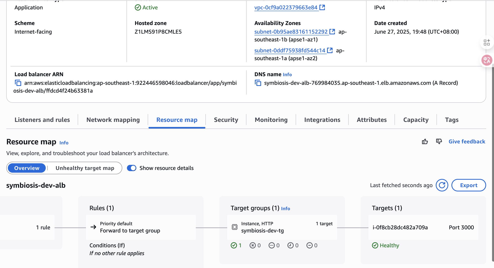

# DevOps Technical Assignment – Portfolio

This repository contains **two independent solutions** matching the CC4.0 DevOps assignment.

| Assignment | Folder | One-click README |
|------------|--------|------------------|
| **1. AWS Cloud Migration** – provision a 3-tier AWS stack with Terraform and host a Node.js MySQL CRUD app | `assignment1-aws-cloud-migration` | [Detailed guide](assignment1-aws-cloud-migration/README.md) |
| **2. Kubernetes Deployment** – run the same app on a local **kind** cluster, delivered as a Helm chart with a one-click Makefile | `assignment2-k8s` | [Detailed guide](assignment2-k8s/README.md) |

---

## Quick Glance – What Works 📸

### Assignment 1 highlights

* ALB URL outputs automatically after `terraform apply` and shows the CRUD UI.
* ASG uses Spot + On-Demand, nodes run Ubuntu 22 + Node 20.
* RDS MySQL is bootstrapped with the required `users` table on first boot.
* Screenshots live in `assignment1-aws-cloud-migration/terraform/screenshot/`.



### Assignment 2 highlights

* Helm chart bundles Deployment, Service, Ingress, PVC & HPA – namespaced by design.
* `make init` spins up a kind cluster, builds & loads the image, then installs the chart.
* Liveness / readiness probes + HPA (CPU) showcase production readiness.

---

## How to reproduce quickly

```bash
# Assignment 1 – AWS
cd assignment1-aws-cloud-migration/terraform/envs/dev
terraform init            # backend config if you want S3 state
terraform plan
terraform apply -auto-approve

# Assignment 2 – Kubernetes
cd assignment2-k8s
make init   # create cluster, build image, deploy chart (≈90 s)
```

For full instructions, diagrams and cost/scaling notes please follow the links in the table above.
