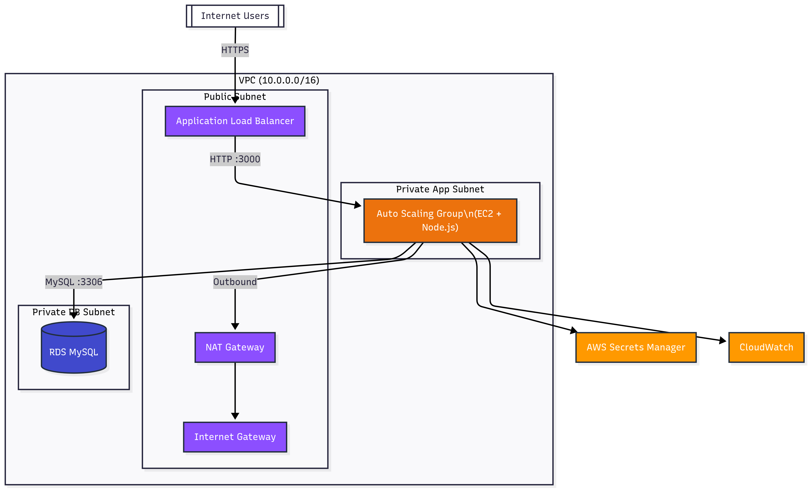

# AWS Cloud Migration (Symbiosis)

This project deploys a 3-tier, scalable, and cost-effective architecture on AWS using Terraform. It hosts a simple Node.js CRUD application.



---

## Terraform Folder Layout  
_Modular by design – easy to reuse & extend_

```text
terraform/
├── modules/                # reusable building blocks
│   ├── vpc/                # VPC, subnets, NAT, IGW
│   ├── alb/                # Application Load Balancer
│   ├── rds/                # MySQL DB + subnet group + SG + bootstrap
│   └── ec2_asg/            # Launch template, ASG, IAM & SG
└── envs/                   # per-environment root modules
    ├── dev/                # points to the shared modules above
    └── prod/               # <- create when you need production
```

Why this layout?
* **Clear separation of concerns** – each module encapsulates a single responsibility.
* **DRY** – the same modules are referenced by both `dev` and `prod`, differing only by variables (instance size, multi-AZ, etc.).
* **Safe iterations** – you iterate inside `envs/dev` without touching prod state.
* **Future proof** – need a `staging` environment?  Just add `envs/stage` with its own tfvars.

---

## Deliverables Checklist

- [x] Terraform code builds the full 3-tier stack in <15 min
- [x] ALB URL outputs after apply and serves the Node.js CRUD app
- [x] Cost-optimised (single NAT, Spot instances, gp3.)
- [x] Automated DB bootstrap & sample table creation
- [x] Module-based layout ready for additional environments

---

## How to Run

### Prerequisites
1.  **AWS Account**: An AWS account with an IAM user configured with appropriate permissions.
2.  **AWS CLI**: Configured with your credentials (`aws configure`).
3.  **Terraform**: Version 1.4 or higher installed.
4.  **S3 Backend**: An S3 bucket and a DynamoDB table for storing Terraform state remotely and managing state locks. Create these once.

### Deployment Steps

1.  **Navigate to the environment directory:**
    ```bash
    cd terraform/envs/dev
    ```

2.  **Initialize Terraform:**
    You will need to configure the S3 backend by providing your bucket name and DynamoDB table name.
    ```bash
    terraform init
    ```

3.  **Plan the deployment:**
    This step shows you what resources Terraform will create.
    ```bash
    terraform plan
    ```

4.  **Apply the configuration:**
    This will build the infrastructure on AWS.
    ```bash
    terraform apply -auto-approve
    ```
    After the apply is complete, the ALB DNS name will be shown as an output. You can access the application using this URL.

5.  **Destroy the infrastructure:**
    To avoid ongoing charges, destroy all the resources when you are done.
    ```bash
    terraform destroy -auto-approve
    ```

---

## Cost & Scalability Decisions

### Cost Optimization

*   **Single NAT Gateway**: The VPC uses a single NAT Gateway shared across all private subnets in multiple Availability Zones. This saves ~50% on NAT Gateway costs compared to a multi-AZ NAT setup and is a reasonable trade-off for non-production environments.
*   **Mixed-Instances ASG**: The Auto Scaling Group for the application uses a mixed-instances policy with 70% Spot Instances and 30% On-Demand Instances. This can provide savings of up to 70% on EC2 costs.
*   **Burstable Instances**: The RDS database and EC2 instances use `t3.micro` instances, which are burstable and part of the AWS Free Tier, making them very cost-effective for development and low-traffic applications.
*   **Storage Autoscaling**: The RDS instance is configured with `max_allocated_storage`, allowing the storage to scale automatically without needing to over-provision capacity upfront.
*   **Secrets Manager**: Credentials are not stored in code but are managed by AWS Secrets Manager. We use a secret with `recovery_window_in_days = 0` to avoid costs for the secret itself in a dev environment.

### Scalability

*   **Modular Design**: The infrastructure is defined in reusable Terraform modules (`vpc`, `rds`, `alb`, `ec2_asg`), which makes it easy to manage and scale. New environments (e.g., `prod`) can be spun up easily by creating a new environment folder.
*   **Auto Scaling Group (ASG)**: The application is deployed on an ASG that can automatically scale the number of instances based on CPU utilization. The scaling policy is set to a target of 50% CPU.
*   **Application Load Balancer (ALB)**: An ALB distributes traffic across the instances in the ASG, ensuring high availability and scalability.
*   **Decoupled Tiers**: The 3-tier architecture (web/ALB, app/EC2, db/RDS) allows each layer to be scaled independently. For example, the database instance class can be scaled up without affecting the application tier.

### Demo Screenshots

Below are a few runtime screenshots taken after `terraform apply`:

| Component | Screenshot |
|-----------|------------|
| ALB target health (green) |  |
| Application list page (`/users`) |  |
