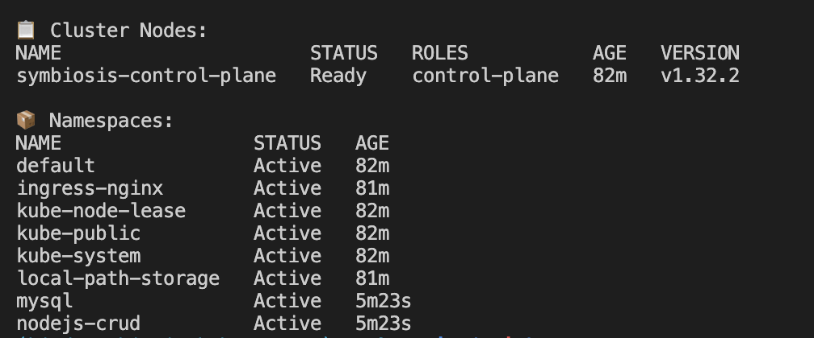
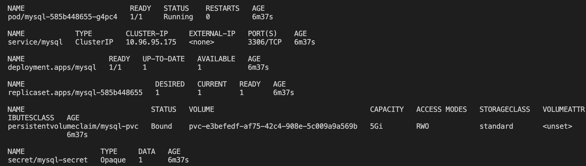
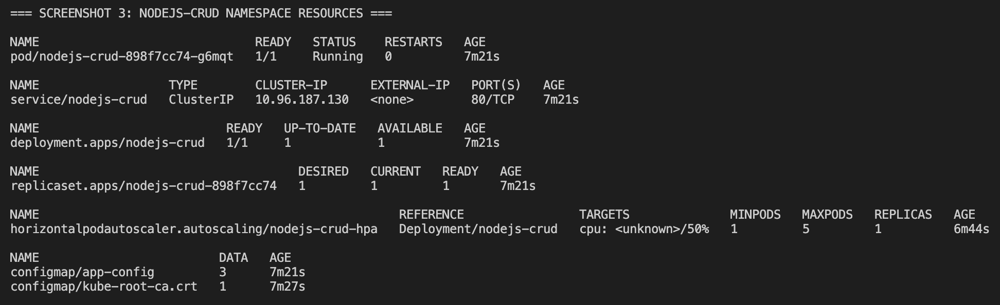

# Assignment 2 – Kubernetes Deployment with Proper Namespace Organization

## 🎯 Project Overview

This assignment demonstrates the containerization and deployment of a Node.js CRUD application on a local Kubernetes cluster using **kind (Kubernetes in Docker)**. The project showcases modern Kubernetes best practices including:

- **Namespace Isolation**: Proper separation of database and application components
- **Health Checks**: Liveness and readiness probes for reliability
- **Horizontal Pod Autoscaling (HPA)**: Automatic scaling based on CPU utilization
- **Cross-Namespace Communication**: Secure service discovery between namespaces
- **Persistent Storage**: Database persistence using Persistent Volume Claims
- **Ingress Configuration**: External access management

## 🏗️ Architecture & Namespace Design

### **Namespace Organization**
```
┌─────────────────────────────────────────┐
│              kind Cluster               │
├─────────────────────────────────────────┤
│  📦 mysql namespace                     │
│  ├── MySQL Deployment                   │
│  ├── MySQL Service                      │
│  ├── MySQL PVC (5Gi storage)           │
│  └── MySQL Secret                       │
├─────────────────────────────────────────┤
│  🚀 nodejs-crud namespace               │
│  ├── Node.js CRUD Deployment            │
│  ├── Node.js Service                    │
│  ├── Application ConfigMap              │
│  ├── MySQL Secret Reference             │
│  ├── Horizontal Pod Autoscaler          │
│  └── Ingress Controller                 │
└─────────────────────────────────────────┘
```

### **Cross-Namespace Communication**
- Node.js app connects to MySQL using FQDN: `mysql.mysql.svc.cluster.local:3306`
- Secrets are duplicated in each namespace for security isolation
- Services are exposed only within their respective namespaces

## 🚀 Quick Start

### Prerequisites
- Docker Desktop or Docker Engine
- kind (Kubernetes in Docker)
- kubectl CLI tool

### 1. Create the Kind Cluster
```bash
# Create cluster configuration
cat <<EOF > kind-cluster.yaml
kind: Cluster
apiVersion: kind.x-k8s.io/v1alpha4
nodes:
  - role: control-plane
    kubeadmConfigPatches:
    - |
      kind: InitConfiguration
      nodeRegistration:
        kubeletExtraArgs:
          node-labels: "ingress-ready=true"
    extraPortMappings:
    - containerPort: 80
      hostPort: 80
    - containerPort: 443
      hostPort: 443
EOF

# Create the cluster
kind create cluster --name symbiosis --config kind-cluster.yaml
```

### 2. Build and Load Application Image
```bash
# cd app
pushd app
# Build the Docker image
DOCKER_BUILDKIT=1 docker build -t nodejs-crud-app:1.0 .

# Load image into kind cluster
kind load docker-image nodejs-crud-app:1.0 --name symbiosis
popd
```

### 3. Deploy Application with Proper Namespaces
```bash
pushd k8s
chmod +x deploy-namespaced.sh
./deploy-namespaced.sh
```

## 📊 Verification & Testing

### Check Deployment Status

**Screenshot 1: Cluster Overview**
```bash
kubectl get nodes
kubectl get namespaces
```


**Screenshot 2: MySQL Namespace Resources**
```bash
kubectl get all,pvc,secrets -n mysql
```


**Screenshot 3: Node.js CRUD Namespace Resources**  
```bash
kubectl get all,configmap,secrets,ingress,hpa -n nodejs-crud
```


### Application Testing

**Screenshot 4: Application Access**
```bash
curl -I http://localhost/
curl http://localhost/ | head -20
```


## 🔧 Key Kubernetes Features Implemented

### 1. **Health Checks**
```yaml
livenessProbe:
  httpGet:
    path: "/"
    port: 3000
  initialDelaySeconds: 30
  periodSeconds: 10

readinessProbe:
  httpGet:
    path: "/"
    port: 3000
  initialDelaySeconds: 15
  periodSeconds: 5
```

### 2. **Horizontal Pod Autoscaler**
```yaml
apiVersion: autoscaling/v2
kind: HorizontalPodAutoscaler
metadata:
  name: nodejs-crud-hpa
  namespace: nodejs-crud
spec:
  scaleTargetRef:
    apiVersion: apps/v1
    kind: Deployment
    name: nodejs-crud
  minReplicas: 1
  maxReplicas: 5
  metrics:
  - type: Resource
    resource:
      name: cpu
      target:
        type: Utilization
        averageUtilization: 50
```

### 3. **Persistent Storage**
```yaml
apiVersion: v1
kind: PersistentVolumeClaim
metadata:
  name: mysql-pvc
  namespace: mysql
spec:
  accessModes: 
    - ReadWriteOnce
  resources:
    requests:
      storage: 5Gi
```

### 4. **Cross-Namespace Service Discovery**
- ConfigMap references MySQL service as: `mysql.mysql.svc.cluster.local`
- Enables secure communication between namespaces
- Maintains service isolation and security boundaries

## 🔄 Scaling Demonstration

To test the HPA functionality:

```bash
# Generate load to trigger scaling
kubectl run -i --tty load-generator --rm --image=busybox --restart=Never -- \
  /bin/sh -c "while sleep 0.01; do wget -q -O- http://nodejs-crud.nodejs-crud.svc.cluster.local; done"

# Watch HPA in action
kubectl get hpa -n nodejs-crud -w
```

## 📈 Monitoring & Observability

### Option 1: Basic Monitoring
```bash
# Monitor resource usage
kubectl top pods -n nodejs-crud
kubectl top pods -n mysql

# Watch scaling events
kubectl get events -n nodejs-crud --sort-by='.lastTimestamp'
```

### Option 2: Advanced Monitoring (Prometheus + Grafana)
```bash
# Install kube-prometheus-stack
helm repo add prometheus-community https://prometheus-community.github.io/helm-charts
helm install monitoring prometheus-community/kube-prometheus-stack -n monitoring --create-namespace

# Access Grafana (after port-forward)
kubectl port-forward svc/monitoring-grafana -n monitoring 3000:80
```

## 🗂️ File Structure
```
assignment2-k8s/
├── k8s/
│   ├── 00-namespaces.yaml         # Namespace definitions
│   ├── secret-mysql.yaml          # MySQL credentials
│   ├── pvc-mysql.yaml             # Persistent storage for MySQL
│   ├── mysql-deploy.yaml          # MySQL deployment & service
│   ├── configmap-app.yaml         # App configuration
│   ├── app-deploy.yaml            # Node.js app deployment & service
│   ├── hpa.yaml                   # Horizontal Pod Autoscaler
│   ├── ingress.yaml               # Ingress configuration
│   └── deploy-namespaced.sh       # Automated deployment script
├── screenshots/                   # Documentation screenshots
│   ├── namespaces.png            # Cluster overview
│   ├── mysql-pvc-secrets.png     # MySQL namespace resources
│   ├── NODEJS-CRUD-resources.png # Node.js app namespace resources
│   └── APPLICATION-ACCESS-TESTING.png # Application testing
├── app/Dockerfile                  # Container image definition
├── kind-cluster.yaml             # Kind cluster configuration
└── README.md                     # This documentation
```

## 🧹 Cleanup

```bash
# complete cleanup
kubectl delete -f k8s/

# Destroy the kind cluster
kind delete cluster --name symbiosis
```

## 🎯 Assignment Objectives Achieved

- ✅ **Containerization**: Node.js CRUD app properly containerized
- ✅ **Namespace Organization**: MySQL and app components separated
- ✅ **Health Checks**: Liveness and readiness probes implemented
- ✅ **Scaling**: HPA configured for automatic horizontal scaling
- ✅ **Persistence**: MySQL data persisted using PVC
- ✅ **Service Discovery**: Cross-namespace communication established
- ✅ **Ingress**: External access configured via Ingress controller
- ✅ **Security**: Proper secret management and namespace isolation

---

> **Note**: This assignment demonstrates production-ready Kubernetes deployment patterns with proper namespace isolation, health monitoring, and automatic scaling capabilities.